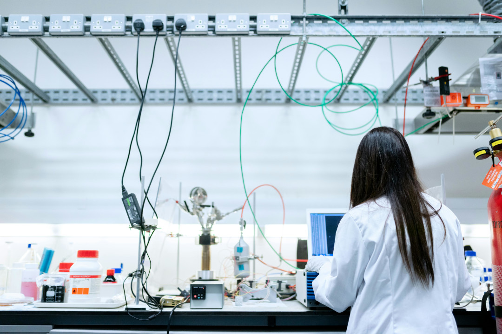
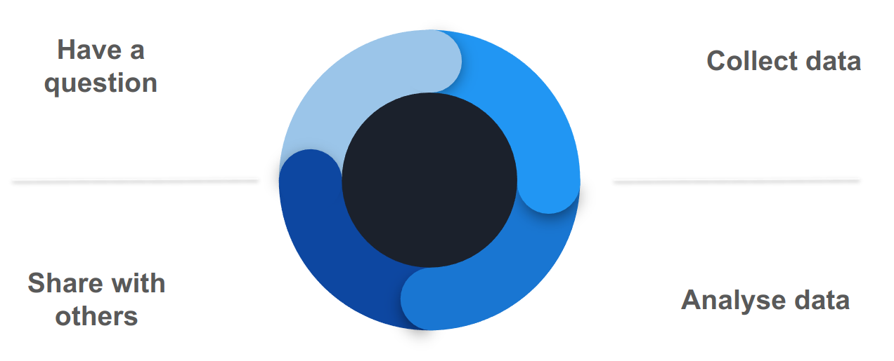
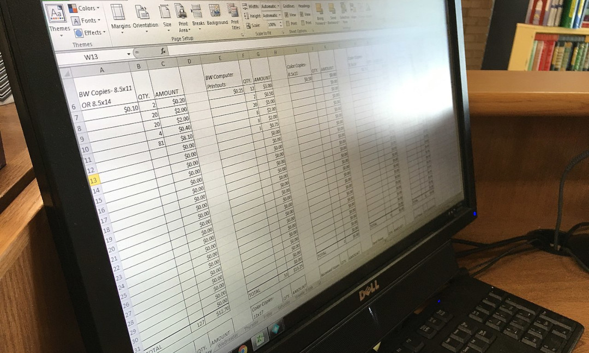
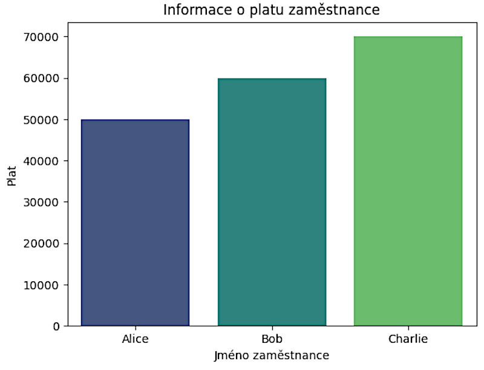

## Welcome to CERN IdeaSquare


* A word about safety
* Stairs access
* Facilities
* Break

===

## 1. Human Rights and Women in STEM


---

## 1.1 What are human rights?


Image: UN Photo / Jean-Marc Ferré. The picture shows the flags of countries at the UN in Geneva.

---

### 1.1Q1 Quiz: What are examples of human rights?

Can you list some human rights that come to your mind ?

===

## 1.2 Where are human rights written down?

* National constitutions
* Equality legislation
* Sector-specific legislation
* National strategies
* Employer policies


---

# France

- Constitution of the Fifth Republic (1958) (FR: https://www.conseil-constitutionnel.fr/le-bloc-de-
constitutionnalite/texte-integral-de-la-constitution-du-4-octobre-1958-en-vigueur
; EN: https://www.conseil-constitutionnel.fr/sites/default/files/as/root/bank_mm/anglais/
constitution_anglais.pdf)
- LOI n° 2021-1774 du 24 décembre 2021 visant à accélérer l'égalité économique et professionnelle (Law on
Economic and Professional Gender Equality 2021) (https://perma.cc/Q4UK-673Q) (See also 
https://www.loc.gov/item/global-legal-monitor/2022-01-23/france-law-on-economic-and-professional-gender-
equality-adopted/)
- LOI n° 2014-873 du 4 août 2014 pour l'égalité réelle entre les femmes et les hommes ((Gender Equality Act
(2014), arts. 2-26 (la vie professionelle) ( https://www.legifrance.gouv.fr/jorf/id/JORFTEXT000029330832)
Additional resources:
https://travail-emploi.gouv.fr/index-de-legalite-professionnelle-calcul-et-questionsreponses
https://eige.europa.eu/gender-mainstreaming/countries/france

---

# Germany

- Basic Law for the Federal Republic of Germany (1949) (art. 3 (equality) (https://www.gesetze-im-internet.de/englisch_gg/)
- (Allgemeines Gleichbehandlungsgesetz – AGG) (General Equal Treatment Act) (2006) - Prohibits discrimination in employment and education on grounds of gender 
(https://www.gesetze-im-internet.de/englisch_agg/englisch_agg.html)
Additional resource: https://eige.europa.eu/gender-mainstreaming/countries/germany

---

# Italy

- Constitution of the Italian Republic (1948) (Articles 3 (Equality), 34 (Education)
(https://www.senato.it/documenti/repository/istituzione/costituzione_inglese.pdf)
- Code of Equal Opportunities between Men and Women (2006) (Legislative Decree No. 198 of 2006) 
((Ensures equal opportunities in education, employment, and social rights)
- Overall strategy focused on gender equality, ‘the National Strategy for Gender Equality’ 2021-2026 
(Strategia nazionale per la parità di genere) (July 2021)
- Law 162/2021 amending the Italian Equal Opportunity Code (Legislative Decree 198/2006)
- Additional resources:
https://eige.europa.eu/gender-mainstreaming/countries/italy?language_content_entity=en
https://www.lexology.com/library/detail.aspx?g=26fe1e91-0c7e-4c24-8b61-9e8b2ce4da07 
 

---

## Switzerland

- Swiss Federal Constitution (1999) (art. 8 (Equality), art. 19 (Education)) (available in EN at 
https://www.fedlex.admin.ch/eli/cc/1999/404/en or in FR at 
https://www.fedlex.admin.ch/eli/cc/1999/404/fr)
- Loi fédérale sur l’égalité entre femmes et hommes (Loi sur l’égalité, Leg (1995)) (Federal Gender Equality 
Act (1995)) (Prohibits gender discrimination in employment; guarantees equal pay and equal access to 
continuing education and training. See arts. 3 and 14.) (Available in EN at 
https://www.fedlex.admin.ch/eli/cc/1996/1498_1498_1498/en or in FR at 
https://www.fedlex.admin.ch/eli/cc/1996/1498_1498_1498/fr).
- Amendments to the Swiss Federal Gender Equality Act that came into force in July 2020 require gender pay gap analyses for companies with 100+ employees

===

## 1.3 Can the same human right be written in more than one place?

* Absolutely! You can often find the same human right in more than one place.
* The same right can be placed in more than one human rights treaty.
* This right can also be found in more than one national law at the same time.

---

### 1.3.1 Example

<div class="r-fit-text">The right to equality is contained<br>
 in many treaties and also in national laws,<br>
 such as a country's constitution and other laws.</div>

===

### 1.4 How do human rights relate to women in STEM?



Image: Photograph by Thisisengineering, Pexels

---

### 1.4.1 Example: The right to education today means that everyone should learn the technological skills needed for work.

Girls and women have the same right to education. Therefore, they should also learn these important technological skills.
Governments are now changing their educational curricula because they realize two important things:
1. everyone needs these skills 
2. these skills are for everyone

---

## 1.5 What are some of the main UN human rights treaties?


Image: UN Photo, Marvin Bolotsky. The picture shows the Commission Chairperson, Mrs. Eleanor Roosevelt (right) with Mrs. Hansa Mehta of India at the UN Commission on Human Rights, 1949.

---

### 1.5.1 Universal Declaration of Human Rights (UDHR), December 10, 1948.

First, the UN issued a declaration. Subsequently, World War II kickstarted things in the modern international human rights system.
This was a declaration, not a treaty. But even this is now considered international law.
Countries decided that they never wanted the atrocities that happened during World War II to be repeated.
Over time, we gained ten international human rights treaties following this declaration.

---

### 1.5.2 Some important human rights treaties for the topic of women in STEM are:

* 1966 – Covenant on Civil and Political Rights, CCPR and its two optional protocols
* 1966 – International Covenant on Economic, Social and Cultural Rights, CESCR
* 1989 - Convention on the Rights of the Child, CRC
* 1979 - Convention on the Elimination of All Forms of Discrimination against Women, CEDAW
* ...and more

---

## 1.5Q1 Quiz: Do the words "agreement", "treaty", "convention" and "optional protocol" mean the same thing when we talk about human rights treaties?

Are they all treaties?

Please select an answer:

<div class="poll" data-poll="treaties">
	<button data-value="yes">Yes</button>
	<br>
	<button data-value="no">No</button>
	<br>
</div>
<!-- <p style="font-size:24px;color:gray;">Responses: <span class="voters" data-poll="treaties">0</span></p> -->

---

### 1.5.3 How do I find out if my government has committed to guaranteeing the rights contained in a particular human rights treaty?

Here you can see where official ratifications of UN treaties by individual countries are tracked:

https://treaties.un.org/Pages/ParticipationStatus.aspx?clang=_en


===

## 1.6 How do we apply existing human rights treaties to girls and women in STEM?

The mentioned human rights and key treaties also apply to girls and women in STEM.
Governments are updating how they provide education to prepare everyone for today's jobs, and that means girls and women too.

---

## 1.6 How do we apply existing human rights treaties to girls and women in STEM?

Important rights are in human rights treaties and also in our national laws, such as :
* Equality – you will find this right in many, many places. And see CEDAW Articles 2, 10, 11 and 13.
* Education – in most major human rights treaties.
* Information – for example, the International Covenant on Civil and Political Rights, Article 19
* Right to science – see the United Nations Covenant on Economic, Social and Cultural Rights, Article 15

===

## 1.7 Examples of famous women in information technology


* Ada Lovelace, mathematician and writer, 1815 - 1852

Image: Science Museum Group, Portrait of Ada King, Countess of Lovelace - Ada Lovelace.
The 1840 painting is attributed to Alfred Edward Chalon.
Ada Lovelace contributed to the first ideas about computer work.

---

### 1.7.1 ... and a few more examples


* Katherine Johnson, one of the first African American women to work as a NASA scientist, 1918 - 2020

Image: NASA / Adam Cuerden. The image shows Katherine Johnson at NASA in 1966.

---
## 1.7.2 Need for women in STEM

(./images/Data_source.png)


## 1.8 Conclusion: Human Rights and Women in STEM

* Rights to equality and education mean that girls and women have the same right to learn and use technology.
* This is important for today's work.
* Women have been working and innovating in technology from the beginning.
* It's normal for girls and women to learn more about programming and technology.
* Let's see what you do with your new skills !

---

## Human Rights

#### Outcomes of countries’ last ‘Universal Periodic Review’ at the UN in Geneva

* France: https://www.ohchr.org/en/hr-bodies/upr/fr-index
* Switzerland: https://www.ohchr.org/en/hr-bodies/upr/ch-index
* Germany: https://www.ohchr.org/en/hr-bodies/upr/de-index
* Italy: https://www.ohchr.org/en/hr-bodies/upr/it-index
* Czechia: https://www.ohchr.org/en/hr-bodies/upr/cz-index

===

# 2. Introduction to Data Analysis

---

## 2.1 Data Everywhere




---

## 2.1 Data Everywhere (2)


Not all data is public. Not all data should be collected.

Image credit : Wikimedia project.

---

## 2.1 Data Everywhere (3)


Image credit : Wikimedia project.

---

## 2.2 Data and Human Rights


Image credit : Wikimedia project.

---

## 2.3 A Resource That Must Be Protected


Image credit : Wikimedia project.

---

## 2.4 Why Are We Here Today?


===

# 3. Python for Data Analysis

---

## 3.1 Why Learn Python?

---

### 3.1.1 What Can Python Do for You?


* In Python, you write commands or instructions in a way that the computer understands.
* It then follows these instructions and responds accordingly. 
* It's like giving the computer a list of tasks. 
* It can make decisions and repeat tasks.

---

### 3.1.2 Who Uses Python?


---

### 3.1.2 Who Uses Python? (2)


---

### 3.1.2 Who Uses Python? (3)


---

### 3.1.3 It's Your Power

* In short, Python allows you to do great things with a computer, whether you're organizing files and data, creating art, or hatching your next science project. 
* It's a tool that unlocks your creativity and allows you to make technology work for you.

===

## 3.2 Questions About Python

---

### 3.2Q1 What Can You Do with Python?

<div class="poll" data-poll="pythonuse">
	<button data-value="one">do only scientific work.</button>
	<br>
	<button data-value="two">anything you want, but you have to buy it first.</button>
	<br>
  <button data-value="three">science, art, business... anything you want!</button>
	<br>
</div>
<!-- <p style="font-size:24px;color:gray;">Responses: <span class="voters" data-poll="pythonuse">0</span></p> -->


---

### 3.2Q2 Why Can So Many People in the World Use Python?

<div class="poll" data-poll="somany">
	<button data-value="one">Because it's simple and accessible.</button>
	<br>
	<button data-value="two">Because it belongs to everyone.</button>
	<br>
  <button data-value="three">Because scientists trust it.</button>
	<br>
</div>
<!-- <p style="font-size:24px;color:gray;">Responses: <span class="voters" data-poll="somany">0</span></p> -->


===

## 3.3 Data in Python

---

### 3.3.1 Variables

```python
favorite_number = 5
```

---

### 3.3.1 Variables (2)


```python
favorite_number = 7
```

Now ```favorite_number``` contains 7 instead of 5.

---

### 3.3.2 Lists (1)

A list of your favorite fruits might look like this:

```python

fruits = ['apple', 'banana', 'orange']

```

---

### 3.3.2 Lists (2)

You can easily add items to the list:

```python
fruits.append('grapes')
print(fruits)
# Output: ['apple', 'banana', 'orange', 'grapes']
```

---

### 3.3.2 Lists (3)

or remove them:

```python
fruits = ['apple', 'banana', 'orange', 'grapes']
fruits.remove('banana')
print(fruits)
# Output: ['apple', 'orange', 'grapes']
```

---

### 3.3.3 Dictionaries

For example, a contact list in Python could be a dictionary:

```python
contact =
{
   'Name': 'John'
  ,'email': 'john@email.com'
  ,'phone': '123-456-7890'
}
```

===


## 3.4 Libraries in Python

#### Libraries are like special tools in a toolbox

* Pandas : A library that specializes in storing and transforming data.
* Matplotlib : A library that can transform data into graphs to make numerical results more attractive.
* Seaborn : A library that enhances Matplotlib to represent statistical data and more easily identify interesting information.

```python
import pandas
import matplotlib.pyplot
import seaborn
```

---

## 3.5 Pandas - Working with Data



---

### 3.5.1 DataFrame and Series

---

#### 3.5.1.1 DataFrame (1)


You can create a **DataFrame** with a dictionary assigning a name to a list of values:

```python
import pandas

data = {'Name': ['Alice', 'Bob', 'Charlie'],
        'Age': [25, 30, 35],
        'City': ['Paris', 'London', 'Berlin']}

df = pandas.DataFrame(data)
print(df)
```

---

#### 3.5.1.1 DataFrame (2)

You can also load a computer file, such as an Excel file (in CSV format) and create a DataFrame:

```python
df = pandas.loadCSV("myFile.csv")
print(df)
```

===

## 3.6 Seaborn and Matplotlib – Data Visualization

---

### 3.6.1 What are they used for?

* Matplotlib and Seaborn are two Python **libraries** for data visualization that make it easy to create attractive and informative statistical graphics.

* Both work well with Pandas DataFrames and simplify the process of creating graphs or other types of diagrams.

---

### 3.6.2 Transforming Data into a Graph

```python
# Creating a Pandas DataFrame
data = {'Name': ['Alice', 'Bob', 'Charlie'],
         'Age': [25, 30, 35],
         'City': ['London', 'Paris', 'Berlin'],
         'Salary': [70000, 65000, 50000]}
dataframe = pd.DataFrame(data)
# Seaborn Example - Bar Plot
plot = sns.barplot(x='Name', y='Salary', data=dataframe, palette='viridis')
plot.set(title='Employee Salary Information', xlabel='Employee Name', ylabel= 'Salary')
```

---

### 3.6.2 Transforming Data into a Graph



===

## 4. Exercise - Titanic Case Study

[https://rightstech.github.io/tutorial](https://rightstech.github.io/tutorial)

===

## 5. How to Continue Learning?

---

### 5.1 Online Courses

---

### 5.2 WIT Mentoring Program

===

# 6. Questions and Answers: Discussion on Mentorship

Tips from our trainers
* My educational journey
* My brief tips for success in study and work

What are your questions for our trainers?

===

# 7. RightsTech Women on LinkedIn
https://linkedin.com/company/rightstech-women

===

# 8. Evaluation Form
Please visit the link that your trainers will show you and fill out the evaluation form.

https://bit.ly/3YlKlj8


