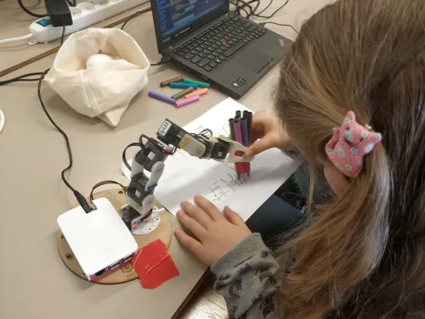

## 1 Lidská práva a ženy v STEM


---

## 1.1 Co jsou lidská práva?


Obrázek: Foto OSN / Jean-Marc Ferré. Na snímku jsou vlajky zemí v OSN v Ženevě.

---

### 1.1Q1 Kvíz: Jaké jsou příklady lidských práv?

Vyjmenujte prosím některá lidská práva, která vás napadají. Otevřené odpovědi.

---

## 1.2 Kde jsou sepsána lidská práva?


Obrázek: Česká národní rada - Stejnopis Sbírky zákonů, Public Domain. Na snímku obálka české ústavy.

---

## 1.3 Může být stejné lidské právo zapsáno na více než jednom místě?

* Absolutně! Často můžete najít stejné lidské právo na více než jednom místě.
* Stejné právo může být umístěno ve více než jedné smlouvě o lidských právech.
* Toto právo lze zároveň nalézt ve více než jednom vnitrostátním právu.

---

### 1.3.1 Příklad

<div class="r-fit-text">Právo na rovnost je obsaženo<br>
 v mnoha smlouvách a také v národních zákonech,<br>
 jako je ústava země a další zákony.</div>

===

### 1.4 Jak se lidská práva vztahují na ženy ve STEM?


Obrázek: Fotografie od Thisisengineering, Pexels

---

### 1.4.1 Příklad: Právo na vzdělání dnes znamená, že by se každý měl naučit technologické dovednosti, které potřebuje pro práci.

Dívky a ženy mají stejné právo na vzdělání. Měly by se tedy také naučit tyto důležité technologické dovednosti.
Vlády nyní mění své vzdělávací osnovy, protože si uvědomují dvě důležité věci:
1. každý potřebuje tyto dovednosti 
2. tyto dovednosti jsou pro každého

---

## 1.5 Jaké jsou některé z hlavních smluv OSN o lidských právech?


Obrázek: Fotografie OSN, Marvin Bolotsky. Na snímku předsedkyně komise, paní Eleanor Rooseveltová (vpravo) s paní Hansou Mehtou z Indie v Komisi OSN pro lidská práva, 1949.

---

### 1.5.1 Všeobecná deklarace lidských práv (UDHR), 10. prosince 1948.

První OSN vydalo prohlášení. Následně druhá světová válka odstartovala věci v moderním mezinárodním systému lidských práv.
Toto bylo prohlášení, ne smlouva. Ale i to je nyní považováno za mezinárodní právo.
Země se rozhodly, že už nikdy nechtějí, aby se zvěrstva, která se stala během druhé světové války, opakovala.
Postupem času jsme po této deklaraci získali deset mezinárodních smluv o lidských právech.

---

### 1.5.2 Několik důležitých smluv o lidských právech pro téma ženy v STEM je:

* 1966 – Pakt o občanských a politických právech, CCPR a jeho dva opční protokoly
* 1966 – Mezinárodní pakt o hospodářských, sociálních a kulturních právech, CESCR
* 1989 - Úmluva o právech dítěte, CRC
* 1979 - Úmluva o odstranění všech forem diskriminace žen, CEDAW
* ...a více

---

## 1.5Q1 Kvíz: Znamená slova „dohoda“, „smlouva“, „konvence“ a „volitelný protokol“ totéž, když mluvíme o smlouvách o lidských právech?

Jsou to všechno smlouvy?
Vyberte prosím odpověď:

<div class="poll" data-poll="treaties">
	<button data-value="ano">Ano</button>
	<br>
	<button data-value="ne">Ne</button>
	<br>
</div>
<p style="font-size:24px;color:gray;">Responses: <span class="voters" data-poll="treaties">0</span></p>

---

## 1.5Q1 Kvíz

<div style="position: relative;height:480px!important;width:1280px!important;">
<canvas data-chart="bar" data-poll="treaties">
, Ano, Ne
, 0, 0
</canvas>
</div>

---

### 1.5.3 Jak zjistím, zda se moje vláda zavázala garantovat práva, která jsou obsažena v konkrétní smlouvě o lidských právech?

Zde se můžete podívat, kde jsou sledovány oficiální ratifikace smluv OSN jednotlivými zeměmi:

https://treaties.un.org/Pages/ParticipationStatus.aspx?clang=_en
Vláda České republiky souhlasila s implementací všech výše uvedených smluv, CCPR, CESCR, CRC, CEDAW.

===

## 1.6 Jak aplikujeme stávající smlouvy o lidských právech na dívky a ženy ve STEM?

Zmíněná lidská práva a klíčové smlouvy se vztahují i na dívky a ženy ve STEM.
Vlády aktualizují způsob, jakým poskytují vzdělání, aby každého připravily na dnešní zaměstnání, a to znamená i dívky a ženy.
Důležitá práva jsou ve smlouvách o lidských právech a také v našich národních zákonech, jako např.
* Rovnost – toto právo najdete na mnoha a mnoha místech. A viz články CEDAW 2, 10, 11 a 13.
* Vzdělání – ve většině hlavních smluv o lidských právech.
* Informace – například Mezinárodní pakt o občanských a politických právech, článek 19
* Právo na vědu – viz Pakt Organizace spojených národů o ekonomických, sociálních a kulturních právech, článek 15

===

## 1.7 Příklady slavných žen v informačních technologiích


* Ada Lovelace, matematička a spisovatelka, 1815 - 1852

Obrázek: Science Museum Group, Portrét Ady Kingové, hraběnky z Lovelace - Ada Lovelace.
Obraz z roku 1840 je připisován Alfredu Edwardu Chalonovi.
Ada Lovelace přispěla k prvním nápadům o práci na počítači.

---

### 1.7.1 ... a několik dalších příkladů


* Katherine Johnson, jedna z prvních Afroameričanek, které pracovaly jako vědkyně NASA, 1918 - 2020

Obrázek: NASA / Adam Cuerden. Na obrázku je Katherine Johnson v NASA v roce 1966.

---

## 1.8 Závěr: Lidská práva a ženy v STEM

* Práva na rovnost a vzdělání znamenají, že dívky a ženy mají stejné právo učit se a využívat technologie.
* To je důležité pro dnešní práci.
* Ženy od začátku pracují a inovují v technologiích.
* Pro dívky a ženy je normální dozvědět se více o programování a technologiích.
* Podívejme se, co uděláte se svými novými dovednostmi!

---

## Lidská práva

* UN Women - Czechia information: https://constitutions.unwomen.org/en/countries/europe/czech-republic
* Outcome of the latest Universal Periodic Review of Czechia:
  https://www.ohchr.org/en/news/2023/07/human-rights-council-adopts-universal-periodic-review-outcomes-czech-republic
* Universal Periodic Review - Czechia: https://www.ohchr.org/en/hr-bodies/upr/cz-index
* Report of the UPR Working Group: https://undocs.org/en/A/HRC/53/4
* Decision of the outcome: https://undocs.org/en/A/HRC/DEC/53/101
* Report of the Working Group: http://undocs.org/en/A/HRC/53/4
* Which UPR recommendations were accepted by Czechia: http://undocs.org/en/A/HRC/53/4/Add.1 and http://undocs.org/en/A/HRC/53/2


===

# 2 Úvod do analýzy dat

---

## 2.1 Data všude


Ne všechna data jsou veřejná. Ne všechna data by měla být shromažďována.

Image credit : Wikimedia project.

---

## 2.1 Data všude (2)


Image credit : Wikimedia project.

---

## 2.2 Data a lidská práva


Image credit : Wikimedia project.

---

## 2.3 Zdroj, který musí být chráněn


Image credit : Wikimedia project.

---

## 2.3 Zdroj, který musí být chráněn (2)


Image credit : Wikimedia project.

---

## 2.4 Proč jsme dnes tady?


===

# 3 Python pro analýzu dat

---

## 3.1 Proč se učit python?

---

### 3.1.1 Co pro vás může udělat Python?


V Pythonu píšete příkazy nebo instrukce způsobem, kterému počítač rozumí. Poté se řídí těmito pokyny a odpovídajícím způsobem zareaguje. Je to trochu jako dát počítači seznam úkolů. Dokáže přijímat rozhodnutí a opakovat úkoly.

---

### 3.1.2 Kdo používá Python?


---

### 3.1.2 Kdo používá Python? (2)


---

### 3.1.2 Kdo používá Python? (3)



---

### 3.1.3 Je to vaše moc

* Stručně řečeno, Python vám umožňuje dělat s počítačem skvělé věci, ať už organizujete soubory, vytváříte umění nebo se ponoříte do nových dobrodružství. 
* Je to nástroj, který odemkne vaši kreativitu a umožní vám, aby technologie pracovala za vás.

===

## 3.2 Otázky o Pythonu

---

### 3.2Q1 Co můžete dělat s Pythonem?

<div class="poll" data-poll="pythonuse">
	<button data-value="one">dělat pouze vědeckou práci.</button>
	<br>
	<button data-value="two">cokoli chcete, ale musíte si to nejprve koupit.</button>
	<br>
  <button data-value="three">věda, umění, obchod... cokoliv chcete!</button>
	<br>
</div>
<p style="font-size:24px;color:gray;">Responses: <span class="voters" data-poll="pythonuse">0</span></p>

---

## 3.2Q1 Co můžete dělat s Pythonem?

<div style="position: relative;height:480px!important;width:1280px!important;">
<canvas data-chart="bar" data-poll="pythonuse">
, vědeckou práci, nejprve koupit, cokoliv chcete
, 0, 0, 0
</canvas>
</div>

---

### 3.2Q2 Proč může tolik lidí na světě používat Python?

<div class="poll" data-poll="somany">
	<button data-value="one">Protože je to jednoduché a dostupné.</button>
	<br>
	<button data-value="two">Protože patří všem.</button>
	<br>
  <button data-value="three">Protože tomu vědci důvěřují.</button>
	<br>
</div>
<p style="font-size:24px;color:gray;">Responses: <span class="voters" data-poll="somany">0</span></p>

---

## 3.2Q2 Proč může tolik lidí na světě používat Python?

<div style="position: relative;height:480px!important;width:1280px!important;">
<canvas data-chart="bar" data-poll="somany">
, jednoduché a dostupné, patří všem, tomu vědci důvěřují
, 0, 0, 0
</canvas>
</div>

===

## 3.3 Data v Pythonu

---

### 3.3.1 Proměnné

```python
oblíbené_číslo = 5
```

---

### 3.3.1 Proměnné (2)


```python
oblíbené_číslo = 7
```

Nyní ```oblíbené_číslo``` obsahuje 7 místo 5.

---

### 3.3.2 Seznamy (1)

Seznam vašeho oblíbeného ovoce může vypadat například takto:

```python

ovoce = ['jablko', 'banán', 'pomeranč']

```

---

### 3.3.2 Seznamy (2)

Do seznamu můžete snadno přidat položky:

```python
fruits.append('hrozny')
tisk (ovoce)
# Výstup: ['jablko', 'banán', 'pomeranč', 'hroznová']
```

---

### 3.3.2 Seznamy (3)

nebo je odstraňte:

```python
ovoce = ['jablko', 'banán', 'pomeranč', 'hrozny']
fruits.remove('banán')
tisk (ovoce)
# Výstup: ['jablko', 'oranžová', 'hroznová']
```

===

### 3.3.3 Slovníky

Například seznam kontaktů v Pythonu může být slovník:

```python
kontakt =
{
   'Jméno': 'John'
  ,'email': 'john@email.com'
  ,'telefon': '123-456-7890'
}
```

===

## 3.3 Otázky týkající se dat v Pythonu

---

### 3.3Q1 Jakou metodu by použil seznam v Pythonu, kdyby chtěl pozvat nového přítele, aby se připojil ke skupině?

<div class="poll" data-poll="party">
	<button data-value="one">party_guest_list.extend(new_friend)</button>
	<br>
	<button data-value="two">party_guest_list.import(new_friend)</button>
	<br>
  <button data-value="three">party_guest_list.append(new_friend)</button>
	<br>
</div>
<p style="font-size:24px;color:gray;">Responses: <span class="voters" data-poll="party">0</span></p>

---

## 3.2Q1 Jakou metodu by použil seznam v Pythonu

<div style="position: relative;height:480px!important;width:1280px!important;">
<canvas data-chart="bar" data-poll="party">
, extend, import, append
, 0, 0, 0
</canvas>
</div>

---

### 3.3Q2 Kdyby byl slovník Pythonu knihou, čemu by byly ekvivalentní klíče?

<div class="poll" data-poll="dictionary">
	<button data-value="one">Názvy kapitol</button>
	<br>
	<button data-value="two">Čísla stránek</button>
	<br>
  <button data-value="three">Obsah</button>
	<br>
</div>
<p style="font-size:24px;color:gray;">Responses: <span class="voters" data-poll="dictionary">0</span></p>

---

### 3.3Q2 Kdyby byl slovník Pythonu knihou, čemu by byly ekvivalentní klíče?

<div style="position: relative;height:480px!important;width:1280px!important;">
<canvas data-chart="bar" data-poll="dictionary">
, Názvy kapitol, Čísla stránek, Obsah
, 0, 0, 0
</canvas>
</div>

---

## 3.4 Knihovny v Pythonu

* Pandas : Knihovna, která se specializuje na ukládání a transformaci dat.
* Matplotlib : Knihovna, která dokáže transformovat data do grafů, aby byly numerické výsledky atraktivnější.
* Seaborn : Knihovna, která vylepšuje Matplotlib, aby reprezentoval statistická data a snadněji identifikoval zajímavé informace.

```python
import pandas as pd
import matplotlib.pyplot as plot
import seaborn as sns
```

===

## 3.5 Pandas - práce s daty


---

### 3.5.1 Datový rámec a série

---

#### 3.5.1.1 DataFrame (1)


Můžete vytvořit DataFrame se slovníkem přiřazujícím název k seznamu hodnot:

```python
import pandas

data = {'Jméno': ['Alice', 'Bob', 'Charlie'],
        'Věk': [25, 30, 35],
        'Město': ['Praha', 'Brno', 'Hradec Králové']}

df = pandas.DataFrame(data)
print(df)
```

---

#### 3.5.1.1 DataFrame (2)

Můžete také načíst počítačový soubor, jako je soubor Excel (ve formátu CSV) a vytvořit DataFrame:

```python
df = pandas.loadCSV("myFile.csv")
print(df)
```

===

## 3.6 Seaborn a Matplotlib – vizualizace dat

---

### 3.6.1 K čemu se používají?

Matplotlib a Seaborn jsou dvě **knihovny** pro vizualizaci dat Pythonu, které usnadňují vytváření atraktivní a informativní statistické grafiky. Oba dobře fungují s Pandas DataFrames a zjednodušují proces vytváření grafů nebo jiných typů diagramů.

---

### 3.6.2 Transformace dat do grafu

```python
# Vytvoření datového rámce Pandas
data = {'Jméno': ['Alice', 'Bob', 'Charlie'],
         'Věk': [25, 30, 35],
         'Město': ['Praha', 'Brno', 'Hradec Králové'],
         'Plat': [50000, 60000, 70000]}
dataframe = pandas.DataFrame(data)
# Seaborn Příklad - Bar Plot
seaborn.barplot(x='Jméno', y='Plat', data=dataframe, palette='viridis')
plot.title('Informace o platu zaměstnance')
plot.xlabel('Jméno zaměstnance')
plot.ylabel('Plat')
plot.show()
```

---

### 3.6.2 Transformace dat do grafu


===

## 4 Cvičení - Případová studie Titanic

[https://rightstech.github.io/tutorial](https://rightstech.github.io/tutorial)

===

## 5 Jak pokračovat v učení?

---

### 5.1 Online kurzy

---

### 5.2 Program mentorů Foxconn

===

# 6 Otázky a odpovědi: Diskuse o mentorství

Tipy od našich trenérů
* Moje cesta za vzděláním
* Moje stručné tipy pro úspěch ve studiu a práci

Jaké jsou vaše otázky pro naše trenéry?

===

# 7 RightsTech žen na LinkedIn
https://linkedin.com/company/rightstech-women

===

# 8 Hodnotící formulář
Navštivte prosím odkaz, který vám vaši trenéři ukážou, a vyplňte hodnotící formulář.


