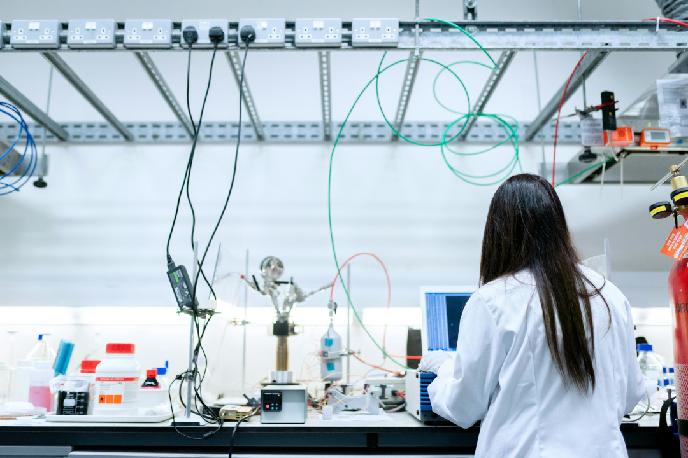
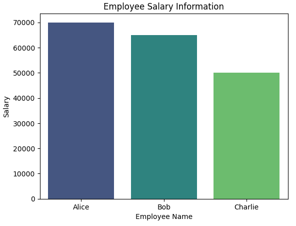

## Bienvenue à CERN IdeaSquare


* Un mot sur la sécurité
* Accès aux escaliers
* Les installations
* Pause café

===

## 1. Les droits des femmes dans les STIM


---

## 1.1 Que sont les droits humains ?


Image : Photo ONU / Jean-Marc Ferré. L'image montre les drapeaux des pays à l'ONU à Genève.

---

### 1.1Q1 Quiz : Quels sont des exemples de droits humains ?

Pouvez-vous citer quelques droits humains qui vous viennent à l'esprit ?

===

## 1.2 Où sont écrits les droits humains ?

* Constitutions nationales
* Législation sur l'égalité
* Législation sectorielle collectives
* Stratégies nationales
* Politiques des employeurs

---

# Tchéquie

- Constitution de la République tchèque (1993) (https://www.psp.cz/en/docs/laws/constitution.html)
- Charte des droits et libertés fondamentaux (1993) (Égalité devant la loi) (Voir art. 1 et 3)
- Loi anti-discrimination (2009) (Égalité de traitement dans l'éducation, l'emploi et la sécurité sociale)
(https://www.zakonyprolidi.cz/cs/2009-198)
- Loi sectorielle sur l'éducation (2004) https://www.zakonyprolidi.cz/cs/2004-561- Loi sectorielle sur l'emploi (2006)
https://www.ilo.org/dyn/natlex/docs/ELECTRONIC/74435/76709/F-983979123/CZE74435 Cze.pdf- Stratégie gouvernementale pour l'égalité des femmes et des hommes pour 2021-2030 Ressource supplémentaire : https://eige.europa.eu/gender-mainstreaming/countries/czechia --- # France - Constitution de la Cinquième République (1958) (FR : https://www.conseil-constitutionnel.fr/le-bloc-de- constitutionnalite/texte-integral-de-la-constitution-du-4-octobre-1958-en-vigueur ; EN : https://www.conseil- constitutionnel.fr/sites/default/files/as/root/bank_mm/anglais/ constitution_anglais.pdf) - LOI n° 2021-1774 du 24 décembre 2021 visant à accélérer l'égalité économique et professionnelle (Loi relative à l'égalité économique et professionnelle entre les femmes et les hommes 2021) (https://perma.cc/Q4UK-673Q) (Voir aussi
https://www.loc.gov/item/global-legal-monitor/2022-01-23/france-law-on-nomic-and-professional-gender-quality-adopted/) - LOI n° 2014-873 du 4 août 2014 pour l'égalité réelle entre les femmes et les hommes ((Loi sur l'égalité des sexes (2014), art. 2-26 (la vie professionnelle) ( https://www.legifrance.gouv.fr/jorf/id/JORFTEXT000029330832)
Ressources complémentaires :
https://travail-emploi.gouv.fr/index-de-legalite-professionnelle-calcul-et-questionsreponses
https://eige.europa.eu/gender-mainstreaming/countries/france

---

# Allemagne

- Loi fondamentale de la République fédérale d'Allemagne (1949) (art. 3 (égalité) (https://www.gesetze-im-internet.de/englisch_gg/)
- (Allgemeines Gleichbehandlungsgesetz – AGG) (Loi générale sur l'égalité de traitement) (2006) - Interdit la discrimination en matière d'emploi et d'éducation fondée sur le sexe
(https://www.gesetze-im-internet.de/englisch_agg/englisch_agg.html)
Ressource supplémentaire : https://eige.europa.eu/gender-mainstreaming/countries/germany

---

# Italie

- Constitution de la République italienne (1948) (articles 3 (Égalité), 34 (Éducation)
(https://www.senato.it/documenti/repository/istituzione/costituzione_inglese.pdf)
- Code de l'égalité des chances entre les hommes et les femmes (2006) (décret législatif n° 198 de 2006)
((Garantit l'égalité des chances en matière d'éducation, d'emploi et de droits sociaux)
- Stratégie globale axée sur l'égalité des sexes, « la Stratégie nationale pour l'égalité des sexes » 2021-2026
(Strategia nazionale per la parità di genere) (juillet 2021)
- Loi 162/2021 modifiant le Code italien de l'égalité des chances (décret législatif 198/2006)
- Ressources supplémentaires :
https://eige.europa.eu/gender-mainstreaming/countries/italy?language_content_entity=en
https://www.lexology.com/library/detail.aspx?g=26fe1e91-0c7e-4c24-8b61-9e8b2ce4da07


---

# Suisse

- Constitution fédérale suisse (1999) (art. 8 (Égalité), art. 19 (Éducation)) (disponible en EN sur https://www.fedlex.admin.ch/eli/cc/1999/404/en ou en FR sur https://www.fedlex.admin.ch/eli/cc/1999/404/fr) - Loi fédérale sur l'égalité entre femmes et hommes (Loi sur l'égalité, Leg (1995)) (Loi fédérale sur l'égalité entre les femmes et les hommes (1995)) (Interdit la discrimination dans l'emploi; garantit l'égalité de rémunération et l'égalité d'accès à la formation continue Voir art.
https://www.fedlex.admin.ch/eli/cc/1996/1498_1498_1498/fr).
- Les modifications de la loi fédérale sur l'égalité entre femmes et hommes, entrées en vigueur en juillet 2020, imposent des analyses des écarts salariaux entre les sexes pour les entreprises de plus de 100 salariés


===

## 1.3 Le même droit humain peut-il être écrit à plus d'un endroit ?

* Absolument ! Vous pouvez souvent trouver le même droit humain à plus d'un endroit.
* Le même droit peut être placé dans plus d'un traité des droits humains.
* Ce droit peut également se trouver dans plus d'une loi nationale en même temps.

---

### 1.3.1 Exemple

<div class="r-fit-text">Le droit à l'égalité est contenu<br>
 dans de nombreux traités et aussi dans les lois nationales,<br>
 comme la constitution d'un pays et d'autres lois.</div>

===

### 1.4 Comment les droits humains sont-ils liés aux femmes dans les STIM ?



Image : Photographie de Thisisengineering, Pexels

---

### 1.4.1 Exemple : Le droit à l'éducation aujourd'hui signifie que tout le monde devrait apprendre les compétences technologiques nécessaires au travail.

Les filles et les femmes ont le même droit à l'éducation. Par conséquent, elles devraient également apprendre ces importantes compétences technologiques.
Les gouvernements modifient maintenant leurs programmes éducatifs car ils réalisent deux choses importantes :
1. tout le monde a besoin de ces compétences 
2. ces compétences sont pour tout le monde

---

## 1.5 Quels sont certains des principaux traités des Nations Unies sur les droits humains ?


Image : Photo ONU, Marvin Bolotsky. L'image montre la présidente de la Commission, Mme Eleanor Roosevelt (à droite) avec Mme Hansa Mehta de l'Inde à la Commission des droits humains de l'ONU, 1949.

---

### 1.5.1 Déclaration universelle des droits humains (DUDH), 10 décembre 1948.

Tout d'abord, l'ONU a émis une déclaration. Par la suite, la Seconde Guerre mondiale a lancé les choses dans le système international moderne des droits humains.
C'était une déclaration, pas un traité. Mais même cela est maintenant considéré comme du droit international.
Les pays ont décidé qu'ils ne voulaient plus jamais que les atrocités qui se sont produites pendant la Seconde Guerre mondiale se répètent.
Au fil du temps, nous avons obtenu dix traités internationaux sur les droits humains à la suite de cette déclaration.

---

### 1.5.2 Quelques traités importants sur les droits humains pour le sujet des femmes dans les STIM sont :

* 1966 – Pacte relatif aux droits civils et politiques, PIDCP et ses deux protocoles facultatifs
* 1966 – Pacte international relatif aux droits économiques, sociaux et culturels, PIDESC
* 1989 - Convention relative aux droits de l'enfant, CDE
* 1979 - Convention sur l'élimination de toutes les formes de discrimination à l'égard des femmes, CEDAW
* ...et plus encore

---

## 1.5Q1 Quiz : Les mots "accord", "traité", "convention" et "protocole facultatif" signifient-ils la même chose lorsque nous parlons des traités sur les droits humains ?

Sont-ils tous des traités ?
Veuillez sélectionner une réponse :

<div class="poll" data-poll="treaties">
	<button data-value="yes">Oui</button>
	<br>
	<button data-value="no">Non</button>
	<br>
</div>
<!-- <p style="font-size:24px;color:gray;">Réponses : <span class="voters" data-poll="treaties">0</span></p> -->

---

### 1.5.3 Comment savoir si mon gouvernement s'est engagé à garantir les droits contenus dans un traité particulier sur les droits humains ?

Vous pouvez voir ici où sont suivies les ratifications officielles des traités de l'ONU par les pays individuels :

https://treaties.un.org/Pages/ParticipationStatus.aspx?clang=_en

===

## 1.6 Comment appliquons-nous les traités existants sur les droits humains aux filles et aux femmes dans les STIM ?

Les droits humains mentionnés et les traités clés s'appliquent également aux filles et aux femmes dans les STIM.<br>
Les gouvernements actualisent la manière dont ils dispensent l'éducation pour préparer leur population aux emplois d'aujourd'hui, et cela inclut les filles et les femmes.

---

## 1.6 Comment appliquons-nous les traités existants sur les droits humains aux filles et aux femmes dans les STIM ?

Des droits importants sont dans les traités sur les droits humains et aussi dans nos lois nationales, tels que :
* L'égalité – vous trouverez ce droit dans de nombreux endroits. Par exemple les articles 2, 10, 11 et 13 de la CEDAW.
* L'éducation – dans la plupart des principaux traités sur les droits humains.
* L'information – par exemple, le Pacte international relatif aux droits civils et politiques, article 19.
* L'accès à la science – voir le Pacte des Nations Unies relatif aux droits économiques, sociaux et culturels, article 15.

===

## 1.7 Exemples de femmes célèbres dans les technologies de l'information


* Ada Lovelace, mathématicienne et écrivaine, 1815 - 1852

Image : Science Museum Group, Portrait d'Ada King, comtesse de Lovelace - Ada Lovelace.
Le tableau de 1840 est attribué à Alfred Edward Chalon.
Ada Lovelace a contribué aux premières idées sur le travail informatique.

---

### 1.7.1 ... et quelques exemples supplémentaires


* Katherine Johnson, l'une des premières femmes afro-américaines à travailler comme scientifique à la NASA, 1918 - 2020

Image : NASA / Adam Cuerden. L'image montre Katherine Johnson à la NASA en 1966.

---

## 1.8 Conclusion : Les droits humains et les Femmes dans les STIM

* Les droits à l'égalité et à l'éducation signifient que les filles et les femmes ont le même droit d'apprendre et d'utiliser la technologie.
* C'est important pour le travail d'aujourd'hui.
* Les femmes travaillent et innovent dans la technologie depuis ses débuts.
* Il est normal pour les filles et les femmes d'en apprendre davantage sur la programmation et la technologie.
* Voyons ce que vous ferez avec vos nouvelles compétences !

---

## Droits Humains

#### Résultats du dernier « Examen périodique universel » des pays à l’ONU à Genève

* France: https://www.ohchr.org/en/hr-bodies/upr/fr-index
* Suisse: https://www.ohchr.org/en/hr-bodies/upr/ch-index
* Allemagne: https://www.ohchr.org/en/hr-bodies/upr/de-index
* Italie: https://www.ohchr.org/en/hr-bodies/upr/it-index
* République Tchèque: https://www.ohchr.org/en/hr-bodies/upr/cz-index

===

# 2. Introduction à l'Analyse de Données

---

## 2.1 Des Données Partout


---

## 2.1 Des Données Partout


Toutes les données ne sont pas publiques. Toutes les données ne devraient pas être collectées.

Crédit image : Projet Wikimedia.

---

## 2.1 Des Données Partout (2)


Crédit image : Projet Wikimedia.

---

## 2.2 Les Données et les droits humains


Crédit image : Projet Wikimedia.

---

## 2.3 Une Ressource qui doit être protégée


Crédit image : Projet Wikimedia.


---

## 2.4 Pourquoi Sommes-Nous Ici Aujourd'hui ?


===

# 3 Python pour l'Analyse de Données

---

## 3.1 Pourquoi Apprendre Python ?

---

### 3.1.1 Que Peut Faire Python Pour Vous ?


En Python, vous écrivez des commandes ou des instructions d'une manière que l'ordinateur comprend. Il suit ensuite ces instructions et réagit en conséquence. C'est un peu comme donner à l'ordinateur une liste de tâches. Il peut prendre des décisions et répéter des tâches.

---

### 3.1.2 Qui Utilise Python ?


---

### 3.1.2 Qui Utilise Python ? (2)


---

### 3.1.2 Qui Utilise Python ? (3)


---

### 3.1.3 C'est Votre Pouvoir

* En bref, Python vous permet de faire de grandes choses avec un ordinateur, que vous organisiez des fichiers et des données, créiez de l'art ou élaboriez votre prochain projet scientifique.
* C'est un outil qui libère votre créativité et vous permet de faire travailler la technologie pour vous.

===

## 3.2 Questions sur Python

---

### 3.2Q1 Que Pouvez-Vous Faire avec Python ?

<div class="poll" data-poll="pythonuse">
	<button data-value="one">faire uniquement du travail scientifique.</button>
	<br>
	<button data-value="two">tout ce que vous voulez, mais vous devez d'abord l'acheter.</button>
	<br>
  <button data-value="three">science, art, affaires... tout ce que vous voulez !</button>
	<br>
</div>
<!-- <p style="font-size:24px;color:gray;">Réponses : <span class="voters" data-poll="pythonuse">0</span></p> -->

---

### 3.2Q2 Pourquoi Tant de Personnes dans le Monde Peuvent-Elles Utiliser Python ?

<div class="poll" data-poll="somany">
	<button data-value="one">Parce que c'est simple et accessible.</button>
	<br>
	<button data-value="two">Parce qu'il appartient à tout le monde.</button>
	<br>
  <button data-value="three">Parce que les scientifiques lui font confiance.</button>
	<br>
</div>
<!-- <p style="font-size:24px;color:gray;">Réponses : <span class="voters" data-poll="somany">0</span></p> -->


===

## 3.3 Les Données en Python

---

### 3.3.1 Variables

```python
nombre_favori = 5
```

---

### 3.3.1 Variables (2)


```python
nombre_favori = 7
```

Maintenant ```nombre_favori``` contient 7 au lieu de 5.

---

### 3.3.2 Listes (1)

Une liste de vos fruits préférés pourrait ressembler à ceci :

```python

fruits = ['pomme', 'banane', 'orange']

```

---

### 3.3.2 Listes (2)

Vous pouvez facilement ajouter des éléments à la liste :

```python
fruits.append('raisin')
print(fruits)
# résultat : ['pomme', 'banane', 'orange', 'raisin']
```

---

### 3.3.2 Listes (3)

ou les supprimer :

```python
fruits = ['pomme', 'banane', 'orange', 'raisin']
fruits.remove('banane')
print(fruits)
# résultat : ['pomme', 'orange', 'raisin']
```

---

### 3.3.3 Dictionnaires

Par exemple, une liste de contacts en Python pourrait être un dictionnaire :

```python
contact =
{
   'nom': 'Lucie'
  ,'email': 'Lucie@email.com'
  ,'téléphone': '123-456-7890'
}
```

===

## 3.4 Bibliothèques en Python

* Pandas : Une bibliothèque spécialisée dans le stockage et la transformation des données.
* Matplotlib : Une bibliothèque qui peut transformer les données en graphiques pour rendre les résultats numériques plus attrayants.
* Seaborn : Une bibliothèque qui améliore Matplotlib pour représenter les données statistiques et identifier plus facilement les informations intéressantes.

```python
import pandas
import matplotlib.pyplot
import seaborn
```

---

## 3.5 Pandas - Travailler avec les Données


---

### 3.5.1 DataFrame et Series

---

#### 3.5.1.1 DataFrame (1)

Vous pouvez créer un **DataFrame** avec un dictionnaire assignant un nom à une liste de valeurs :

```python
import pandas

donnees = {'Nom': ['Alice', 'Bob', 'Charlie'],
        'Age': [25, 30, 35],
        'Ville': ['Paris', 'London', 'Berlin']}

df = pandas.DataFrame(donnees)
print(df)
```

---

#### 3.5.1.1 DataFrame (2)

Vous pouvez également charger un fichier informatique, comme un fichier Excel (au format CSV) et créer un DataFrame :

```python
df = pandas.loadCSV("monFichier.csv")
print(df)
```

===

## 3.6 Seaborn et Matplotlib – Visualisation des Données

---

### 3.6.1 À quoi servent-ils ?

* Matplotlib et Seaborn sont deux **bibliothèques** Python pour la visualisation de données qui facilitent la création de graphiques statistiques attrayants et informatifs.
* Elles fonctionnent bien avec les DataFrames de Pandas et simplifient le processus de création de graphiques ou d'autres types de diagrammes.

---

### 3.6.2 Transformer les Données en Graphique

```python
# Création d'un DataFrame Pandas
donnees = {'Nom': ['Alice', 'Bob', 'Charlie'],
         'Age': [25, 30, 35],
         'Ville': ['London', 'Paris', 'Berlin'],
         'Salaire': [70000, 65000, 50000]}
dataframe = pandas.DataFrame(donnees)
# Exemple Seaborn - Histogramme
seaborn.barplot(x='Nom', y='Salaire', data=dataframe, palette='viridis')
plot.set(title='Informations sur les Salaires des Employés',xlabel='Nom de l\'Employé', ylabel='Salaire')
```

---

### 3.6.2 Transformer les Données en Graphique



===

## 4. Exercice - Étude de Cas sur le Titanic

[https://rightstech.github.io/tutorial](https://rightstech.github.io/tutorial)

===

## 5. Comment Continuer à Apprendre ?

---

### 5.1 Cours en Ligne

---

### 5.2 Programme de Mentorat WIT

===

# 6. Questions et Réponses : Discussion sur le Mentorat

Conseils de nos formatrices :
* Mon parcours éducatif
* Mes brefs conseils pour réussir dans les études et le travail

Quelles sont vos questions pour nos formatrices ?

===

# 7. RightsTech Women LinkedIn

https://linkedin.com/company/rightstech-women

===

# 8 Formulaire d'Évaluation
Veuillez visiter le lien que vos formateurs vous montreront et remplir le formulaire d'évaluation.

https://bit.ly/3YlKlj8

