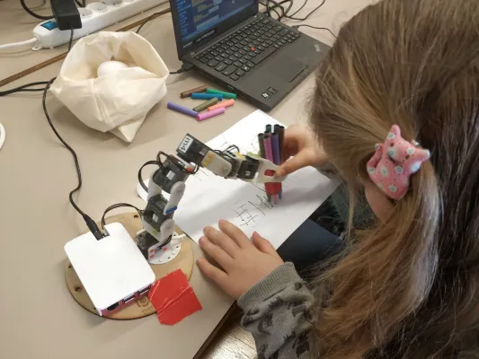

## 1 Les Droits de l'Homme et les Femmes dans les STEM


---

## 1.1 Que sont les droits de l'homme ?


Image : Photo ONU / Jean-Marc Ferré. L'image montre les drapeaux des pays à l'ONU à Genève.

---

### 1.1Q1 Quiz : Quels sont des exemples de droits de l'homme ?

Veuillez énumérer quelques droits de l'homme qui vous viennent à l'esprit. Réponses ouvertes.

---

## 1.2 Où sont écrits les droits de l'homme ?


Image : Conseil national tchèque - Copie officielle du Recueil des lois, Domaine public. L'image montre la couverture de la constitution tchèque.

---

## 1.3 Le même droit de l'homme peut-il être écrit à plus d'un endroit ?

* Absolument ! Vous pouvez souvent trouver le même droit de l'homme à plus d'un endroit.
* Le même droit peut être placé dans plus d'un traité des droits de l'homme.
* Ce droit peut également se trouver dans plus d'une loi nationale en même temps.

---

### 1.3.1 Exemple

<div class="r-fit-text">Le droit à l'égalité est contenu<br>
 dans de nombreux traités et aussi dans les lois nationales,<br>
 comme la constitution d'un pays et d'autres lois.</div>

===

### 1.4 Comment les droits de l'homme sont-ils liés aux femmes dans les STEM ?


Image : Photographie de Thisisengineering, Pexels

---

### 1.4.1 Exemple : Le droit à l'éducation aujourd'hui signifie que tout le monde devrait apprendre les compétences technologiques nécessaires au travail.

Les filles et les femmes ont le même droit à l'éducation. Par conséquent, elles devraient également apprendre ces importantes compétences technologiques.
Les gouvernements modifient maintenant leurs programmes éducatifs car ils réalisent deux choses importantes :
1. tout le monde a besoin de ces compétences 
2. ces compétences sont pour tout le monde

---

## 1.5 Quels sont certains des principaux traités des Nations Unies sur les droits de l'homme ?


Image : Photo ONU, Marvin Bolotsky. L'image montre la présidente de la Commission, Mme Eleanor Roosevelt (à droite) avec Mme Hansa Mehta de l'Inde à la Commission des droits de l'homme de l'ONU, 1949.

---

### 1.5.1 Déclaration universelle des droits de l'homme (DUDH), 10 décembre 1948.

Tout d'abord, l'ONU a émis une déclaration. Par la suite, la Seconde Guerre mondiale a lancé les choses dans le système international moderne des droits de l'homme.
C'était une déclaration, pas un traité. Mais même cela est maintenant considéré comme du droit international.
Les pays ont décidé qu'ils ne voulaient plus jamais que les atrocités qui se sont produites pendant la Seconde Guerre mondiale se répètent.
Au fil du temps, nous avons obtenu dix traités internationaux sur les droits de l'homme à la suite de cette déclaration.

---

### 1.5.2 Quelques traités importants sur les droits de l'homme pour le sujet des femmes dans les STEM sont :

* 1966 – Pacte relatif aux droits civils et politiques, PIDCP et ses deux protocoles facultatifs
* 1966 – Pacte international relatif aux droits économiques, sociaux et culturels, PIDESC
* 1989 - Convention relative aux droits de l'enfant, CDE
* 1979 - Convention sur l'élimination de toutes les formes de discrimination à l'égard des femmes, CEDAW
* ...et plus encore

---

## 1.5Q1 Quiz : Les mots "accord", "traité", "convention" et "protocole facultatif" signifient-ils la même chose lorsque nous parlons des traités sur les droits de l'homme ?

Sont-ils tous des traités ?
Veuillez sélectionner une réponse :

<div class="poll" data-poll="treaties">
	<button data-value="yes">Oui</button>
	<br>
	<button data-value="no">Non</button>
	<br>
</div>
<p style="font-size:24px;color:gray;">Réponses : <span class="voters" data-poll="treaties">0</span></p>

---

## 1.5Q1 Quiz

<div style="position: relative;height:480px!important;width:1280px!important;">
<canvas data-chart="bar" data-poll="treaties">
, Oui, Non
, 0, 0
</canvas>
</div>

---

### 1.5.3 Comment savoir si mon gouvernement s'est engagé à garantir les droits contenus dans un traité particulier sur les droits de l'homme ?

Vous pouvez voir ici où sont suivies les ratifications officielles des traités de l'ONU par les pays individuels :

https://treaties.un.org/Pages/ParticipationStatus.aspx?clang=_en

===

## 1.6 Comment appliquons-nous les traités existants sur les droits de l'homme aux filles et aux femmes dans les STEM ?

Les droits de l'homme mentionnés et les traités clés s'appliquent également aux filles et aux femmes dans les STEM.
Les gouvernements mettent à jour la manière dont ils dispensent l'éducation pour préparer tout le monde aux emplois d'aujourd'hui, et cela inclut les filles et les femmes.
Des droits importants sont dans les traités sur les droits de l'homme et aussi dans nos lois nationales, tels que
* L'égalité – vous trouverez ce droit dans de nombreux, nombreux endroits. Et voir les articles 2, 10, 11 et 13 de la CEDAW.
* L'éducation – dans la plupart des principaux traités sur les droits de l'homme.
* L'information – par exemple, le Pacte international relatif aux droits civils et politiques, article 19
* Le droit à la science – voir le Pacte des Nations Unies relatif aux droits économiques, sociaux et culturels, article 15

===

## 1.7 Exemples de femmes célèbres dans les technologies de l'information


* Ada Lovelace, mathématicienne et écrivaine, 1815 - 1852

Image : Science Museum Group, Portrait d'Ada King, comtesse de Lovelace - Ada Lovelace.
Le tableau de 1840 est attribué à Alfred Edward Chalon.
Ada Lovelace a contribué aux premières idées sur le travail informatique.

---

### 1.7.1 ... et quelques exemples supplémentaires


* Katherine Johnson, l'une des premières femmes afro-américaines à travailler comme scientifique à la NASA, 1918 - 2020

Image : NASA / Adam Cuerden. L'image montre Katherine Johnson à la NASA en 1966.

---

## 1.8 Conclusion : Les Droits de l'Homme et les Femmes dans les STEM

* Les droits à l'égalité et à l'éducation signifient que les filles et les femmes ont le même droit d'apprendre et d'utiliser la technologie.
* C'est important pour le travail d'aujourd'hui.
* Les femmes travaillent et innovent dans la technologie depuis le début.
* Il est normal pour les filles et les femmes d'en apprendre davantage sur la programmation et la technologie.
* Voyons ce que vous ferez avec vos nouvelles compétences !

---

## Droits de l'Homme

* Informations UN Women - Tchéquie : https://constitutions.unwomen.org/en/countries/europe/czech-republic
* Résultat du dernier Examen périodique universel de la Tchéquie :
  https://www.ohchr.org/en/news/2023/07/human-rights-council-adopts-universal-periodic-review-outcomes-czech-republic
* Examen périodique universel - Tchéquie : https://www.ohchr.org/en/hr-bodies/upr/cz-index
* Rapport du Groupe de travail de l'EPU : https://undocs.org/en/A/HRC/53/4
* Décision sur le résultat : https://undocs.org/en/A/HRC/DEC/53/101
* Rapport du Groupe de travail : http://undocs.org/en/A/HRC/53/4
* Quelles recommandations de l'EPU ont été acceptées par la Tchéquie : http://undocs.org/en/A/HRC/53/4/Add.1 et http://undocs.org/en/A/HRC/53/2

===

# 2 Introduction à l'Analyse de Données

---

## 2.1 Des Données Partout


Toutes les données ne sont pas publiques. Toutes les données ne devraient pas être collectées.

Crédit image : Projet Wikimedia.

---

## 2.1 Des Données Partout (2)


Crédit image : Projet Wikimedia.

---

## 2.2 Les Données et les Droits de l'Homme


Crédit image : Projet Wikimedia.

---

## 2.3 Une Ressource Qui Doit Être Protégée


Crédit image : Projet Wikimedia.

---

## 2.3 Une Ressource Qui Doit Être Protégée (2)


Crédit image : Projet Wikimedia.

---

## 2.4 Pourquoi Sommes-Nous Ici Aujourd'hui ?


===

# 3 Python pour l'Analyse de Données

---

## 3.1 Pourquoi Apprendre Python ?

---

### 3.1.1 Que Peut Faire Python Pour Vous ?


En Python, vous écrivez des commandes ou des instructions d'une manière que l'ordinateur comprend. Il suit ensuite ces instructions et réagit en conséquence. C'est un peu comme donner à l'ordinateur une liste de tâches. Il peut prendre des décisions et répéter des tâches.

---

### 3.1.2 Qui Utilise Python ?


---

### 3.1.2 Qui Utilise Python ? (2)


---

### 3.1.2 Qui Utilise Python ? (3)



---

### 3.1.3 C'est Votre Pouvoir

* En bref, Python vous permet de faire de grandes choses avec un ordinateur, que vous organisiez des fichiers, créiez de l'art ou plongiez dans de nouvelles aventures. 
* C'est un outil qui libère votre créativité et vous permet de faire travailler la technologie pour vous.

===

## 3.2 Questions sur Python

---

### 3.2Q1 Que Pouvez-Vous Faire avec Python ?

<div class="poll" data-poll="pythonuse">
	<button data-value="one">faire uniquement du travail scientifique.</button>
	<br>
	<button data-value="two">tout ce que vous voulez, mais vous devez d'abord l'acheter.</button>
	<br>
  <button data-value="three">science, art, affaires... tout ce que vous voulez !</button>
	<br>
</div>
<p style="font-size:24px;color:gray;">Réponses : <span class="voters" data-poll="pythonuse">0</span></p>

---

## 3.2Q1 Que Pouvez-Vous Faire avec Python ?

<div style="position: relative;height:480px!important;width:1280px!important;">
<canvas data-chart="bar" data-poll="pythonuse">
, travail scientifique, acheter d'abord, tout ce que vous voulez
, 0, 0, 0
</canvas>
</div>

---

### 3.2Q2 Pourquoi Tant de Personnes dans le Monde Peuvent-Elles Utiliser Python ?

<div class="poll" data-poll="somany">
	<button data-value="one">Parce que c'est simple et accessible.</button>
	<br>
	<button data-value="two">Parce qu'il appartient à tout le monde.</button>
	<br>
  <button data-value="three">Parce que les scientifiques lui font confiance.</button>
	<br>
</div>
<p style="font-size:24px;color:gray;">Réponses : <span class="voters" data-poll="somany">0</span></p>

---

## 3.2Q2 Pourquoi Tant de Personnes dans le Monde Peuvent-Elles Utiliser Python ?

<div style="position: relative;height:480px!important;width:1280px!important;">
<canvas data-chart="bar" data-poll="somany">
, simple et accessible, appartient à tout le monde, les scientifiques lui font confiance
, 0, 0, 0
</canvas>
</div>

===

## 3.3 Les Données en Python

---

### 3.3.1 Variables

```python
nombre_prefere = 5
```

---

### 3.3.1 Variables (2)


```python
nombre_prefere = 7
```

Maintenant ```nombre_prefere``` contient 7 au lieu de 5.

---

### 3.3.2 Listes (1)

Une liste de vos fruits préférés pourrait ressembler à ceci :

```python

fruits = ['pomme', 'banane', 'orange']

```

---

### 3.3.2 Listes (2)

Vous pouvez facilement ajouter des éléments à la liste :

```python
fruits.append('raisin')
print(fruits)
# Sortie : ['pomme', 'banane', 'orange', 'raisin']
```

---

### 3.3.2 Listes (3)

ou les supprimer :

```python
fruits = ['pomme', 'banane', 'orange', 'raisin']
fruits.remove('banane')
print(fruits)
# Sortie : ['pomme', 'orange', 'raisin']
```

---

### 3.3.3 Dictionnaires

Par exemple, une liste de contacts en Python pourrait être un dictionnaire :

```python
contact =
{
   'Nom': 'Jean'
  ,'email': 'jean@email.com'
  ,'téléphone': '123-456-7890'
}
```

===

## 3.3 Questions sur les Données en Python

---

### 3.3Q1 Quelle méthode une liste Python utiliserait-elle si elle voulait inviter un nouvel ami à rejoindre le groupe ?

<div class="poll" data-poll="party">
	<button data-value="one">liste_invites_soiree.extend(nouvel_ami)</button>
	<br>
	<button data-value="two">liste_invites_soiree.import(nouvel_ami)</button>
	<br>
  <button data-value="three">liste_invites_soiree.append(nouvel_ami)</button>
	<br>
</div>
<p style="font-size:24px;color:gray;">Réponses : <span class="voters" data-poll="party">0</span></p>

---

## 3.3Q1 Quelle méthode une liste Python utiliserait-elle

<div style="position: relative;height:480px!important;width:1280px!important;">
<canvas data-chart="bar" data-poll="party">
, extend, import, append
, 0, 0, 0
</canvas>
</div>

---

### 3.3Q2 Si un dictionnaire Python était un livre, à quoi correspondraient les clés ?

<div class="poll" data-poll="dictio">
	<button data-value="one">Titres de chapitres</button>
	<br>
	<button data-value="two">Numéros de pages</button>
	<br>
  <button data-value="three">Table des matières</button>
	<br>
</div>
<p style="font-size:24px;color:gray;">Réponses : <span class="voters" data-poll="dictio">0</span></p>

---

### 3.3Q2 Si un dictionnaire Python était un livre, à quoi correspondraient les clés ?

<div style="position: relative;height:480px!important;width:1280px!important;">
<canvas data-chart="bar" data-poll="dictio">
, Titres de chapitres, Numéros de pages, Table des matières
, 0, 0, 0
</canvas>
</div>

---

## 3.4 Bibliothèques en Python

* Pandas : Une bibliothèque spécialisée dans le stockage et la transformation des données.
* Matplotlib : Une bibliothèque qui peut transformer les données en graphiques pour rendre les résultats numériques plus attrayants.
* Seaborn : Une bibliothèque qui améliore Matplotlib pour représenter les données statistiques et identifier plus facilement les informations intéressantes.

```python
import pandas as pd
import matplotlib.pyplot as plot
import seaborn as sns
```

---

## 3.5 Pandas - Travailler avec les Données


---

### 3.5.1 DataFrame et Series

---

#### 3.5.1.1 DataFrame (1)

Vous pouvez créer un DataFrame avec un dictionnaire assignant un nom à une liste de valeurs :

```python
import pandas

donnees = {'Nom': ['Alice', 'Bob', 'Charlie'],
        'Age': [25, 30, 35],
        'Ville': ['Prague', 'Brno', 'Hradec Králové']}

df = pandas.DataFrame(donnees)
print(df)
```

---

#### 3.5.1.1 DataFrame (2)

Vous pouvez également charger un fichier informatique, comme un fichier Excel (au format CSV) et créer un DataFrame :

```python
df = pandas.loadCSV("monFichier.csv")
print(df)
```

===

## 3.6 Seaborn et Matplotlib – Visualisation des Données

---

### 3.6.1 À quoi servent-ils ?

Matplotlib et Seaborn sont deux **bibliothèques** Python pour la visualisation de données qui facilitent la création de graphiques statistiques attrayants et informatifs. Les deux fonctionnent bien avec les DataFrames de Pandas et simplifient le processus de création de graphiques ou d'autres types de diagrammes.

---

### 3.6.2 Transformer les Données en Graphique

```python
# Création d'un DataFrame Pandas
donnees = {'Nom': ['Alice', 'Bob', 'Charlie'],
         'Age': [25, 30, 35],
         'Ville': ['Prague', 'Brno', 'Hradec Králové'],
         'Salaire': [50000, 60000, 70000]}
dataframe = pandas.DataFrame(donnees)
# Exemple Seaborn - Graphique à Barres
seaborn.barplot(x='Nom', y='Salaire', data=dataframe, palette='viridis')
plot.title('Informations sur les Salaires des Employés')
plot.xlabel('Nom de l\'Employé')
plot.ylabel('Salaire')
plot.show()
```

---

### 3.6.2 Transformer les Données en Graphique


===

## 4 Exercice - Étude de Cas Titanic

[https://rightstech.github.io/tutorial](https://rightstech.github.io/tutorial)

===

## 5 Comment Continuer à Apprendre ?

---

### 5.1 Cours en Ligne

---

### 5.2 Programme de Mentorat WIT

===

# 6 Questions et Réponses : Discussion sur le Mentorat

Conseils de nos formateurs
* Mon parcours éducatif
* Mes brefs conseils pour réussir dans les études et le travail

Quelles sont vos questions pour nos formateurs ?

===

# 7 RightsTech Women sur LinkedIn
https://linkedin.com/company/rightstech-women

===

# 8 Formulaire d'Évaluation
Veuillez visiter le lien que vos formateurs vous montreront et remplir le formulaire d'évaluation.

